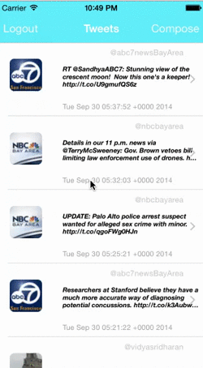

tweetiit
========

a basic twitter like app
Time Spent: 15 hours 
<ul>
<li>User can sign in using OAuth login flow</li>
<li>User can view last 20 tweets from their home timeline</li>
<li>The current signed in user will be persisted across restarts</li>
<li>In the home timeline, user can view tweet with the user profile picture, username, tweet text, and timestamp. </li>
<li>User can pull to refresh</li>
<li>User can compose a new tweet by tapping on a compose button.</li>
<li>User can tap on a tweet to view it, with controls to retweet, favorite, and reply.</li>
  

